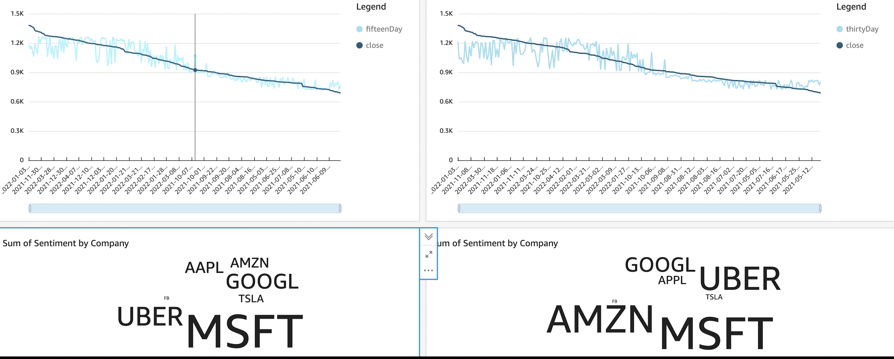

# Project Description
In this project, I have developed real-time streaming pipelines using AWS Kinesis that collect real-time stock price data for 10 stocks, perform some analysis on it and display it to the end user using AWS Quicksight. I have got stock price data for stocks from Yahoo Finance API, Stock news from Stockwits, User discussions from Reddit and Twitter. I've used teh stock price data to calculate the 30-day moving average and the 15-day moving average as seen fom the image below. In addition to this, I've used reddit and twitter discussions to understand the overall sentiment around that particular stock. This provided the user with a very comprehensive view of the stock market and the news and can help the user strategize their investment strategy

